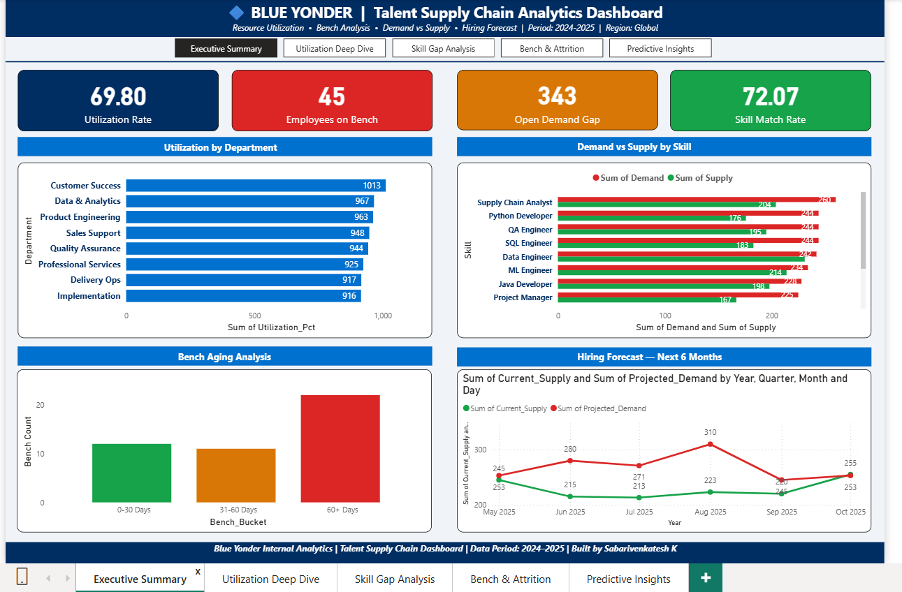
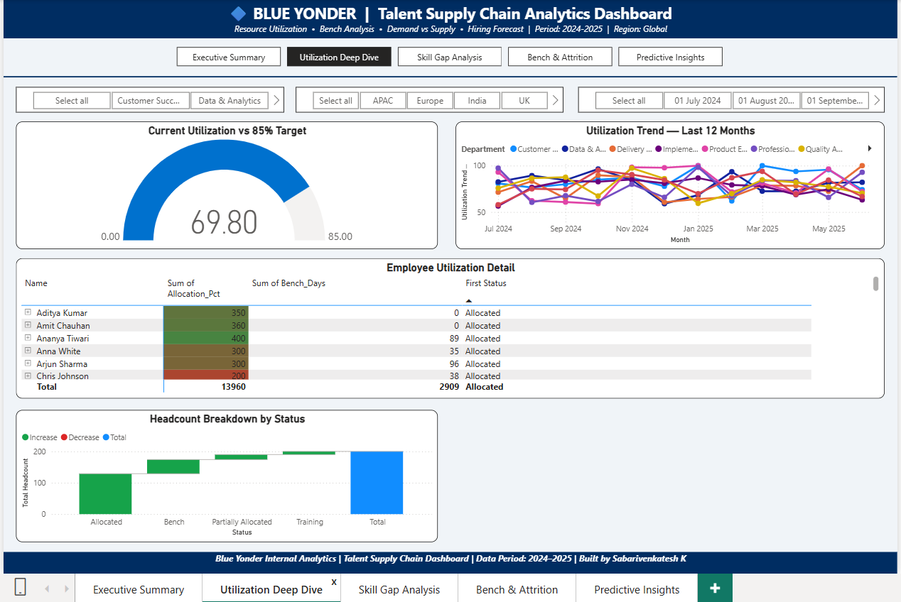
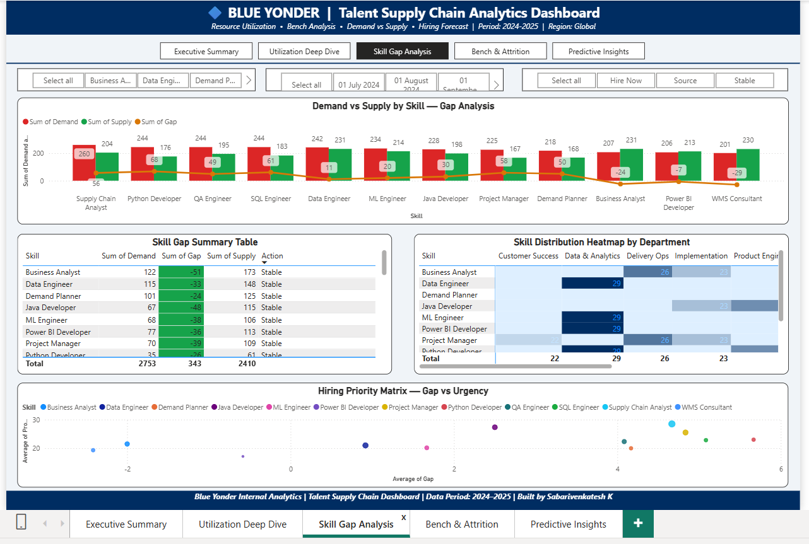
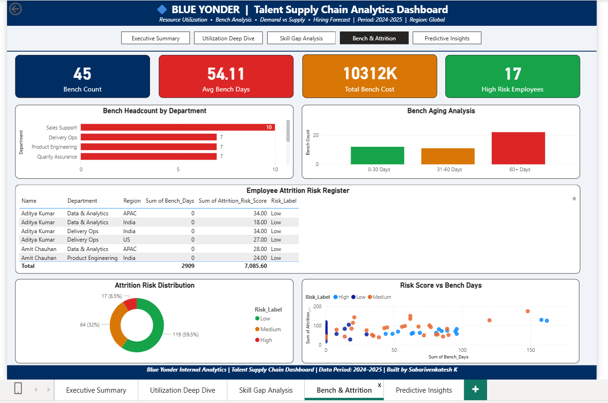
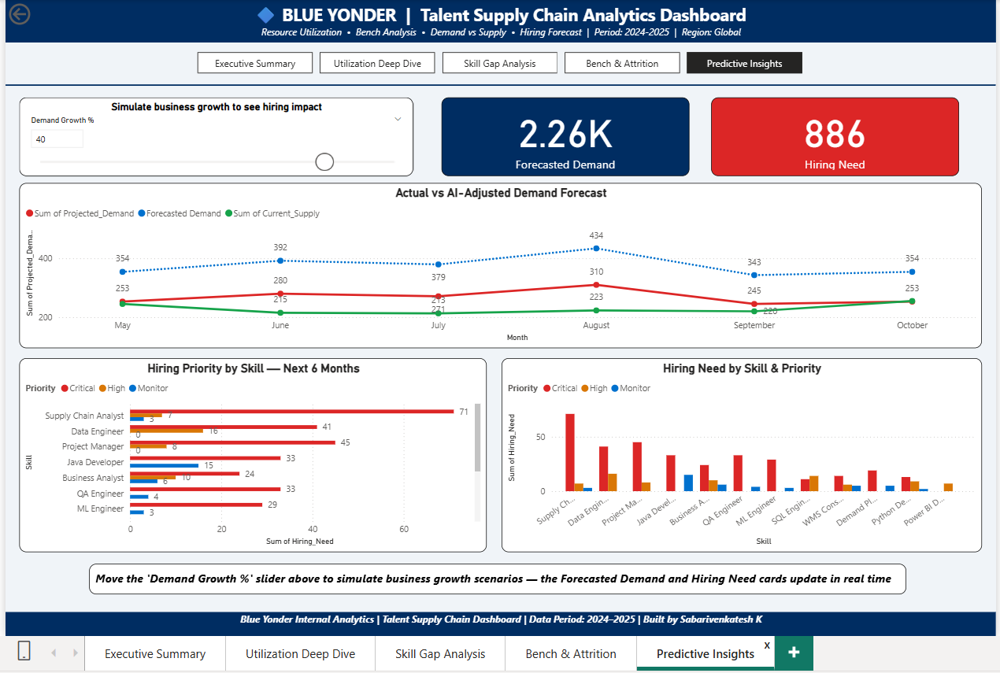

# 🔷 Blue Yonder — Talent Supply Chain Analytics Dashboard


> A fully interactive, 5-page Power BI dashboard simulating Blue Yonder's internal  
> Talent Supply Chain — covering resource utilization, skill gap analysis, bench  
> management, attrition risk, and predictive hiring forecasts.

---

## 📸 Dashboard Preview

| Page | Preview |
|------|---------|
| Page 1 — Executive Summary |  |
| Page 2 — Utilization Deep Dive |  |
| Page 3 — Skill Gap Analysis |  |
| Page 4 — Bench & Attrition |  |
| Page 5 — Predictive Insights |  |

---

## 📁 Project Structure

```
blue-yonder-talent-dashboard/
│
├── BY_TalentSupplyChain_Dashboard_Sabarivenkatesh.pbix   ← Main Power BI file
├── BY_Dataset.xlsx                                        ← Source dataset
├── README.md                                              ← This file
│
└── screenshots/
    ├── page1_executive_summary.png
    ├── page2_utilization.png
    ├── page3_skill_gap.png
    ├── page4_bench_attrition.png
    └── page5_predictive.png
```

---

## 🎯 Project Purpose

This dashboard applies **supply chain thinking to talent management** —
treating employees as inventory with demand, supply, gaps, and forecasts.
Built to simulate how Blue Yonder could monitor and optimize its internal
workforce across departments, skills, and regions.

---

## 📊 Dataset Overview

**File:** `BY_Dataset.xlsx` — 5 sheets

| Sheet | Rows | Key Columns |
|-------|------|-------------|
| Employee_Data | 200 | Emp_ID, Department, Skill, Status, Allocation_Pct, Bench_Days, Bench_Cost |
| Demand_Supply | 144 | Month, Skill, Demand, Supply, Gap, Action |
| Utilization_Trend | 96 | Month, Department, Headcount, Utilization_Pct |
| Hiring_Forecast | 72 | Month, Skill, Projected_Demand, Current_Supply, Hiring_Need, Priority |
| Attrition_Risk | 200 | Emp_ID, Bench_Days, Attrition_Risk_Score, Risk_Label |

---

## 🔗 Data Model Relationships

```
Employee_Data ──(Emp_ID 1:1)──► Attrition_Risk
Employee_Data ──(Department M:M)──► Utilization_Trend
Employee_Data ──(Skill M:M)──► Demand_Supply
Demand_Supply ──(Skill M:M)──► Hiring_Forecast
```

---

## 🧮 DAX Measures

```dax
-- 1. Utilization Rate %
Utilization Rate % =
DIVIDE(SUM(Employee_Data[Allocation_Pct]),
COUNTROWS(Employee_Data) * 100) * 100

-- 2. Bench Count
Bench Count =
COUNTROWS(FILTER(Employee_Data, Employee_Data[Status] = "Bench"))

-- 3. Total Demand Gap
Total Demand Gap = SUM(Demand_Supply[Gap])

-- 4. Skill Match Rate %
Skill Match Rate % =
DIVIDE(
    SUMX(Demand_Supply, MIN(Demand_Supply[Demand], Demand_Supply[Supply])),
    SUM(Demand_Supply[Demand]), 0
) * 100

-- 5. Avg Bench Days
Avg Bench Days =
AVERAGEX(
    FILTER(Employee_Data, Employee_Data[Status] = "Bench"),
    Employee_Data[Bench_Days]
)

-- 6. Total Bench Cost
Total Bench Cost = SUM(Employee_Data[Bench_Cost])

-- 7. High Risk Employees
High Risk Employees =
COUNTROWS(FILTER(Attrition_Risk, Attrition_Risk[Risk_Label] = "High"))

-- 8. Total Headcount
Total Headcount = COUNTROWS(Employee_Data)

-- 9. Forecasted Demand (What-If)
Forecasted Demand =
SUM(Hiring_Forecast[Projected_Demand]) *
(1 + 'Demand Growth %'[Demand Growth % Value] / 100)

-- 10. Hiring Need (What-If)
Hiring Need =
MAX([Forecasted Demand] - SUM(Hiring_Forecast[Current_Supply]), 0)
```

---

## 🧱 Calculated Column

```dax
-- In Employee_Data table
Bench_Bucket =
IF(Employee_Data[Bench_Days] = 0, "Active",
IF(Employee_Data[Bench_Days] <= 30, "0-30 Days",
IF(Employee_Data[Bench_Days] <= 60, "31-60 Days",
"60+ Days")))
```

---

## 📄 Dashboard Pages

### Page 1 — Executive Summary
- **Audience:** C-Suite / Leadership
- **Visuals:** 4 KPI Cards, Utilization by Department bar chart,
  Demand vs Supply by Skill chart, Bench Aging column chart,
  Hiring Forecast line chart
- **Key Insight:** Utilization at 69.80% vs 85% target. 45 employees
  on bench costing 10,312K.

---

### Page 2 — Utilization Deep Dive
- **Audience:** Department Managers
- **Visuals:** 3 Slicers (Department, Region, Month), Gauge chart
  vs 85% target, Utilization Trend line chart by department,
  Employee detail matrix, Headcount waterfall chart
- **Key Insight:** All departments fluctuating between 50–100%
  utilization with no department consistently hitting 85% target.

---

### Page 3 — Skill Gap Analysis
- **Audience:** HR / Talent Acquisition
- **Visuals:** 3 Slicers (Skill, Month, Action), Combo chart
  (Demand + Supply bars + Gap line), Skill Gap RAG table,
  Skill-Department heatmap, Hiring Priority scatter plot
- **Key Insight:** Supply Chain Analyst has the highest gap of 56.
  Power BI Developer and WMS Consultant have surplus supply.

---

### Page 4 — Bench & Attrition
- **Audience:** Resource Managers / HR Business Partners
- **Visuals:** 4 KPI Cards, Bench by Department bar chart,
  Bench Aging column chart, Attrition Risk Register table,
  Risk Distribution donut chart, Risk Score vs Bench Days scatter
- **Key Insight:** 17 high-risk employees. 60+ day bench employees
  show the strongest correlation with high attrition scores.

---

### Page 5 — Predictive Insights ⭐
- **Audience:** Strategic Planning / Senior Leadership
- **Visuals:** What-If slider (0–50% growth), 2 live KPI cards,
  Actual vs AI-Adjusted forecast line chart, Hiring Priority
  by Skill bar chart, Hiring Need by Skill and Priority chart
- **Key Insight:** At 40% business growth, company needs 886
  additional hires. Supply Chain Analyst is the most critical
  skill to hire with 71 units of hiring need.

---

## 🎨 Color Theme

| Color | Hex Code | Usage |
|-------|----------|-------|
| Dark Navy | `#002D62` | Header, primary brand color |
| Blue | `#0071CE` | Charts, section labels, buttons |
| Red | `#DC2626` | Bench, demand, critical risk |
| Orange | `#D97706` | Demand gap, medium risk |
| Green | `#16A34A` | Supply, low risk, positive KPIs |
| Purple | `#7C3AED` | High risk employees KPI |
| Light Grey | `#F0F4F8` | Canvas background |

---

## 💡 Key Business Insights

1. **Utilization Gap:** 69.80% vs 85% target — 15.2% underutilization
2. **Bench Cost:** 45 employees on bench costing **10,312K** in idle salary
3. **Critical Bench:** Majority of bench employees are 60+ days — highest attrition risk
4. **Top Skill Gap:** Supply Chain Analyst shortage of 56 units — most urgent hire
5. **Attrition Risk:** 17 high-risk employees — losing them worsens skill gaps further
6. **Skill Coverage:** 72.07% skill match rate — 28% demand unmet by current workforce
7. **Predictive:** At 40% growth → 886 additional hires needed across all skills

---

## 🚀 How to Open This Dashboard

1. Download and install **Power BI Desktop** (free) from
   [powerbi.microsoft.com](https://powerbi.microsoft.com)
2. Clone or download this repository
3. Open `BY_TalentSupplyChain_Dashboard_Sabarivenkatesh.pbix`
4. If prompted, click **"Keep current"** for data source settings
5. Navigate pages using the buttons at the top of each page

---

## 🛠️ Tools & Technologies

- **Visualization:** Microsoft Power BI Desktop
- **Data Source:** Microsoft Excel (.xlsx)
- **Query Language:** DAX (Data Analysis Expressions)
- **Data Modeling:** Power BI Model View (Star Schema)
- **Version Control:** Git / GitHub

---

## 👤 Author

**Sabarivenkatesh K**
*Data Analytics | Power BI | Talent Supply Chain*

[](https://www.linkedin.com/in/sabarivenkatesh-k/)  [](https://github.com/Sabarivenkatesh3/)

---

## 📌 Note

This dashboard was built as part of a job interview project for
**Blue Yonder** to demonstrate skills in data modeling, DAX,
business intelligence design, and supply chain analytics thinking.
